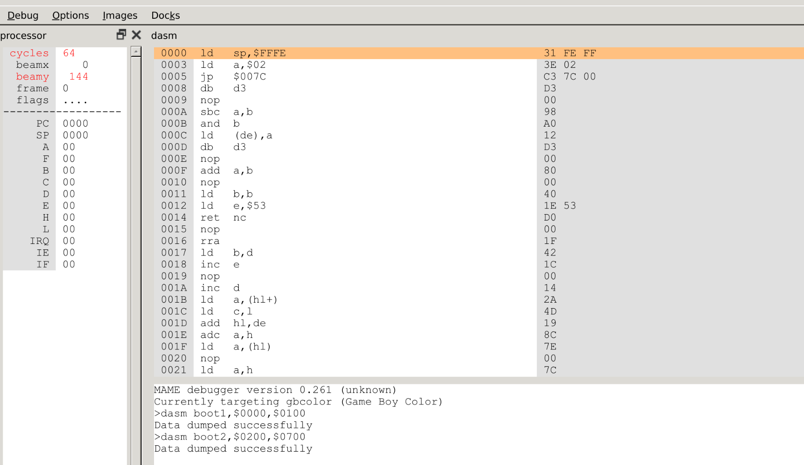
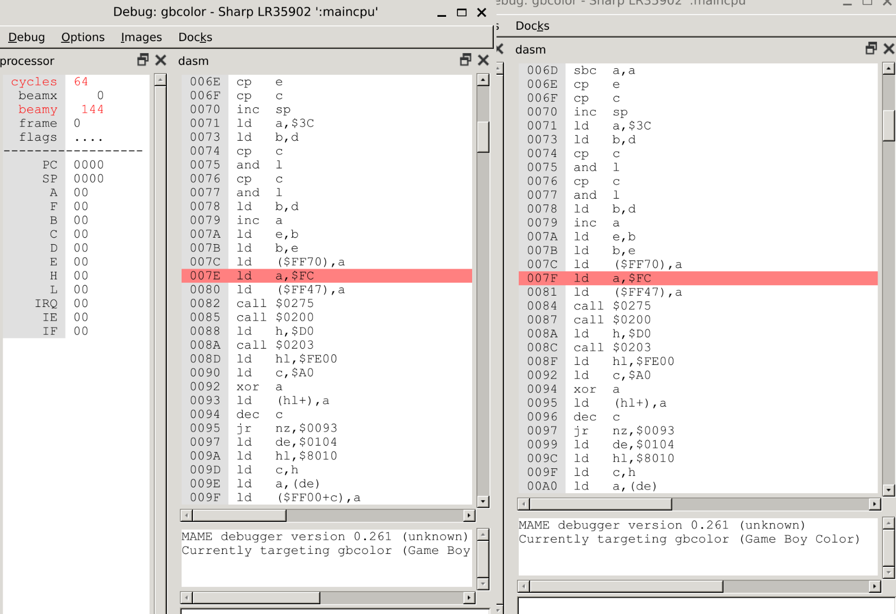
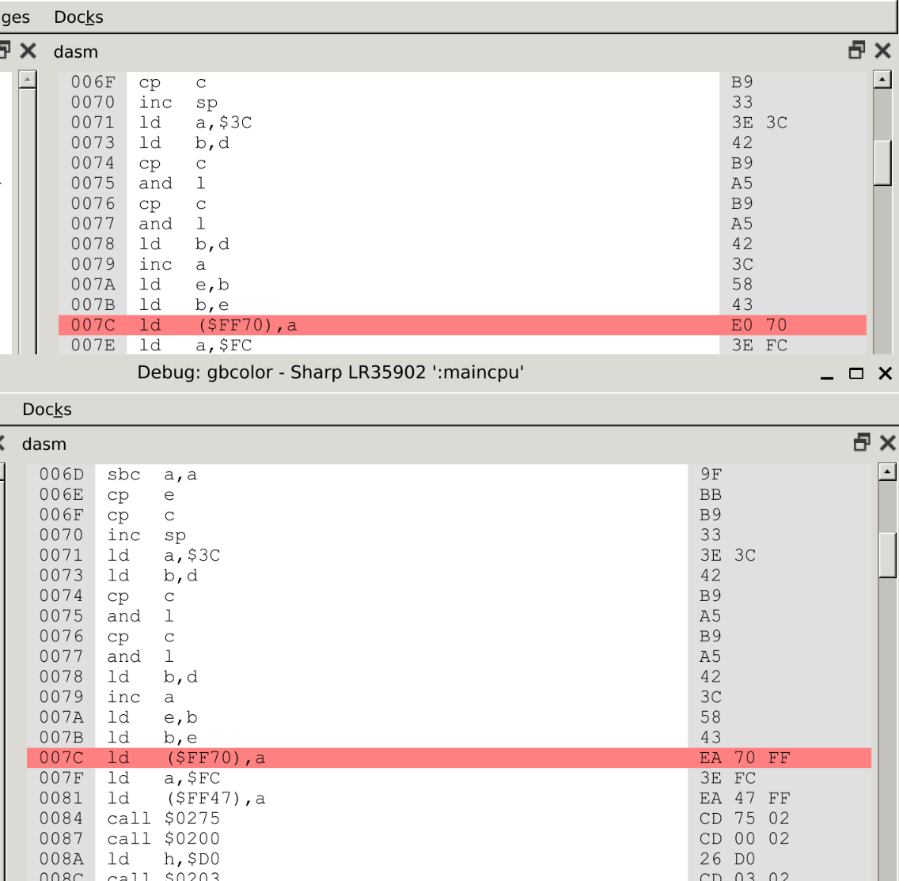

# I lost two days because of a byte

## Booting

I was playing around with a Gameboy Color emulator, so I sourced the original boot ROM used by Nintendo and analyzed it to try to understand it better.
I found that it was rather straghtforward: Clean RAM, initialize stack pointer, initialize some registers, then do some security checks and boot the game cartridge.
I thought I could give it a try to come up with my own boot ROM for the Gameboy Color.

I downloaded [MAME](https://github.com/mamedev/mame/tree/master) and [RGBDS](https://github.com/gbdev/rgbds/tree/master), then executed the boot ROM and launched MAME debugger to take a peek at it.
My first thought was to compare the original Nintendo boot ROM and see what works, what should be removed and what should be changed/improved. But for the first run let's just disassemble the original ROM, paste the disassembled instructions on a `.asm` file, compile it and run it.
This should yield the same result, since I just grabbed the same instructions as the original boot ROM.

As explained by [gbdev.io](https://gbdev.io/pandocs), the Nintendo Gameboy Color boot ROM has two parts: The first stage that goes from $0000 to $00FF and a second part that goes from $0200 to $08FF.
There's a handy command in MAME debugger to dump a disassembly of these files:

```
dasm boot1,$0000,$0100
dasm boot2,$0200,$0900
```



## First inspection

The disassembled boot ROMs looked good, pretty straightforward. It took me a couple of minutes to correct some syntax errors and removing unwanted strings, but after that I had two boot ROMs that `rgbasm` understands and can compile.
I thought it would be best to have a footer that makes sure the boot ROMs are of the correct length, after all we know for sure what their length _must_ be. So I added the following footer to boot ROM 1 (inspired by [SameBoy](https://github.com/LIJI32/SameBoy/blob/master/BootROMs/cgb_boot.asm)):

```asm
BootEnd:
  IF BootEnd > $0100
    FAIL "Boot rom is {BootEnd} long, must not be greater than $0100."
  ENDC
; Boot ROM ends at $100 and then hands it over to the cartridge ROM. 
  ds $100 - @
```

I run the code thinking "this should not alert, given it's the original boot ROM". But it does!

```bash
rgbasm -o bios/gbc_boot.1.o bios/gbc_boot.1.asm
FATAL: bios/gbc_boot.1.asm(180):
    Boot rom is $105 long, must not be greater than $0100.
make: *** [Makefile:18: bios/gbc_boot.1] Error 1
```

How is it possible that the disassembled boot ROM is larger than the raw boot ROM?

## 1 byte

I spent two full days debugging this. My initial thought was that this footer was not working correctly, I must have made a mistake somewhere and this is not calculating the length correctly.
After removing the footer and re-running the boot ROM, I found out it's not working. No Nintendo logo and my "Hello World" game is not working. If I switch to the original boot ROM (with the raw bytes in it) it works.

My second thought was a mistake while copying/pasting the disassembled code from MAME, so I checked every instruction in the boot ROM to compare it with the original raw bytes boot ROM running in MAME.
All the instructions were the same, still my compiled ROM was 5 bytes larger than the original one.

After this I thought there might be a bug in the MAME debugger, maybe I hit an edge case and the disassemble function for this variation of Z80 is doing something strange. I went through the MAME debugger code, everything seemed in order.

Lastly I thought this could be a bug in RGBDS assembler, so I went there and reviewed the entire codebase, but everything seemed in order and I was not able to find anything that could explain this behaviour.

After spending hours thinking back on what could be doing this I decided to run two versions of MAME: one with the original raw bytes and another with my compiled ROM. And I found somerhing strange:



At $007C both instructions are the same: `ld ($FF70),a` but the instruction immediately following that one changes by 1 byte. In the case of the original raw bytes ROM (left) the next instruction is at $007E, while in my compiled ROM (right) the next instruction can be found at $007F.
So I decided to examine these two opcodes individually, surprisingly I found that they are different:



The original boot ROM shows that `ld ($FF70),a` opcode is `E0 70` and my compiled ROM shows `EA 70 FF`. Using a [handy opcode reader](https://meganesu.github.io/generate-gb-opcodes/) for this specific CPU we can quickly find out what both instructions are doing:

The `EA` opcode is a 3 byte instruction that stores the contents of register `a` into an address specified by a constant 16bit. So in this case `EA 70 FF` means to store the contents of `a` in address `$FF70` (the Gameboy Color CPU is little endian byte first).

The `E0` opcode is a 2 byte instruction that stores the contents of register `a` into address `$FF` + a constant 8bit number. So `E0 70` means to store the contents of `a` at address `$FF70`.

They are the same instruction! The problem was that when disassembling both opcodes yield the same instruction, but when assembling them back to opcodes yield a different one.

## Learning

Never assume that compiling a disassembled binary will yield the exact same binary.
